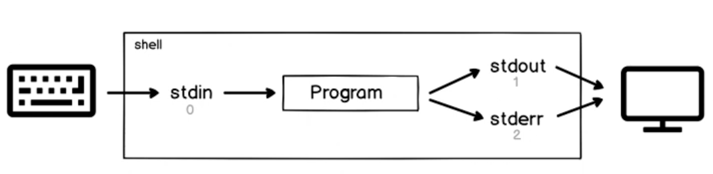
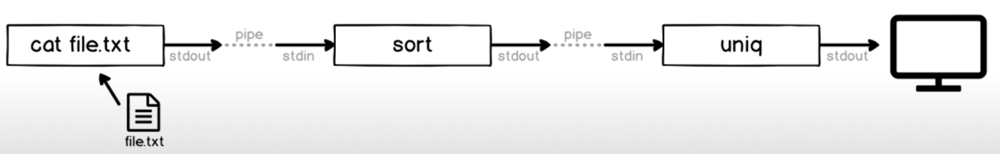

# Linux - Shell

## 변수

### 1. 일반 변수

- 데이터를 넣는 그릇
- 선언할 필요없이 사용 가능
- 변수명 : 문자, 숫자, _로 구성될수 있지만, 시작은 반드시 문자나 _로 시작

1.1 변수 선언 : VARNAME=VALUE

1.2 변수 확인 : echo $VARNAME , set (| grep VARNAME) -- 전체 조회 (grep으로 필터링)

1.3 변수 제거 : unset VARNAME

### 2. 환경 변수

- 동작되는 프로그램에게 영향을 주는 변수

2.1 환경 변수 선언 : export VARNAME=VALUE

2.2 환경 변수 확인 : env

2.3 기억해야할 변수들 :

| PATH  | 명령어 탐색 경로               |
|-------|-------------------------|
| HOME  | 홈디렉토리의 경로, CD 명령 실행시 적용 |
| USER  | 로그인 사용자의 이름             |
| SHELL | 로그인 SHELL의 이름           |

## 규칙

### Quoting Rule

- Metacharacters
    - Shell에서 특별히 의미를 정해 놓은 문자들
    - | ? () $ ... * 등

- Quoting Rule : 메탙 문자의 의미를 제거하고 단순 문자로 변경
    - BackSlash(\\)
        - \ 바로 두의 메타 문자는 특별한 의미를 제거
    - Double Quotes(" ")
        - " "내의 모든 메타문자의 의미를 제거. 단 $, ' '은 제외
    - Single Quotes(' ')
        - ' ' 내의 모든 메타문자의 의미를 제거

### Nesting Commands

- Command 치환
    - 명령어의 실행 결과를 치환하여 명령을 실행

- Nesting Commands
    - $(command)\
      echo "Today is $(date)"\
      실행 결과 -> today is `Mon Dec 27 11:38:49 UTC 2021`
    - 'command'\
      echo "Today is \`date\`"\
      실행 결과 -> today is `Mon Dec 27 11:38:49 UTC 2021`

### Alias

- alias
    - Shell의 명령에 새로운 이름을 부여
    - 명령들을 조합하여 새로운 이름의 명령을 생성

- alias 관리 명령
    - alias 등록 : alias name='command'
    - alias 확인 : alias or alias name
    - alias 삭제 : unalias name

- 예시
    - history --> `alias h='history'`
    - rm -i --> `alias rm='rm -i'`

### Prompt

- Shell의 Prompt?
    - PS1 변수를 이용해 shell의 기본 프롬프트 모양을 설정
    - Bash shell에서만 Prompt 모양에 적용 가능한 특수 문자가 존재

| 특수문자  | 의미              |
|-------|-----------------|
| \h    | 호스트 이름          |
| \u    | 사용자 이름          |
| \w    | 작업 디렉토리 - 절대 경로 |
| \W    | 작업 디렉토리 - 상대경로  |
| \d    | 오늘 날짜           |
| \t    | 현재 시간           |
| \$    | $또는 #프롬프트 모양    |

- 예시
    - `PS1='[\u\h \W]\$ `

### Redirection

- Communication Channels
  

- redirection
    - 입력의 방향을 바꿔줌

| Communication Channels | Redirection | characters | 의 미                      |
|------------------------|-------------|------------|--------------------------|
| STDIN                  | 0<          | 0<<        | 입력을 키보드가 아닌 파일을 통해 받음    |
| STDOUT                 | 1>          | 1>>        | 표준 출력을 터미널이 아닌 파일로 출력    |
| STDERR                 | 2>          | 2>>        | 표준 에러 출력을 터미널이 아닌 파일로 출력 |

- `echo "asdff" > echo.txt  `
  터미널이 아니라 echo.txt로 출력

### Pipeline

- 명령의 실행결과를 다음 명령의 입력으로 전달
- 리눅스의 명령어를 조합하여 사용
- 기호 : command1 | command2 | command 3

  

- `ls | wc -l` 현재 파일 목록 -> 줄 계산 => 현재 디렉토리에 있는 파일의 수

## Bash Shell Script

### Shell Script?

- 리눅스 command들을 모아 놓은 ASCII TEXT 파일
- 실행 퍼미션을 할당해야 실행 가능
- Bash shell script에서 특별히 의미가 정해진 기능  
  \# -> Comment(주석)
- Shell 구문은 기본 top-down 방식으로 해석해서 실행됨
- Sub shell -> 내부의 Shell을 새로 실행

## Positional Parameters

- 위치 매개변수
- 입력하는 argument들은 $0, $1, $2와 같은 변수에 저장되어 Script에 전달  
  name of shell script : $0  
  first argument : $1  
  second argument: $2  
  Number of arguments in $#  
  List of all parameters in $@, $*

- Special shell variables  
  로그인 shell의 PID : $$  
  현재 작업 디렉토리 : $PWD  
  부모 프로세스 ID : $PPID

## Input & Output

### echo

- prints text to standard output  
  echo <옵션> <메시지>  
  -n 메시지 출력후 newline 문자를 추가하지 않는다.  
  -e backslash escapes 문자를 해석하여 특별한 의미를 지정한다.
    - \t TAB키
    - \n 줄바꿈
    - \a alert(bell)

- Example
    - echo "Your time is up"
    - echo "Your time is up" > time.txt
    - echo -n "Name :"
    - echo -e "First\tSecond"

### read

- reads text from standard input  
  read <옵션> 변수명
    - -n 지정한 문자수만큼 입력 받는다.
    - -t 지정된 시간안에 입력 받는다.
    - -s silent mod로 입력하는 글자가 보이지 않는다.

- read 명령에서 변수 명 생략 시 기본 reply 변수에 채워진다.

- example
    - read name
    - read -t10 -n8 password
    - read -t10 -n8 -s password
    - read
    - echo -n "Name : "; read name
    - echo $name

### printf

- 서식 format에 맞춰서 출력    
  printf format <메시지>
    - %d or %i 숫자
    - %s 문자열
    - %f 실수형 숫자

- example
    - printf "Hello linux shell\n"
    - printf "Name: %s Age: %d" GUMBO 30

## Branching

### exit

- 실행된 프로그램이 종료된 상태를 전달  
  exit <숫자>  
  $? 종료 코드 값
    - 0 프로그램 또는 명령이 성공으로 종료했음을 의미
    - 1-255 프로그램 또는 명령이 실패로 종료했음을 의미
        - 1 일반 에러
        - 2 syntax error
        - 126 명령을 실행할 수 없음
        - 127 명령(파일)이 존재하지 않음
        - 128 + N 종료시그널 + N(kill -9 PID -> 128 + 9 -> 137 출력)

- example
    - cp file1
    - echo $?
    - sleep 100
    - `<Ctrl><C>`
    - echo %?

### test

- 비교 연산자
    - test <명령어> or \[명령어]
- 명령어 실행결과를 true(0) 또는 false(1)로 리턴한다.
- test 명령어는 다양한 연산자를 지원한다.

|연산자|설명|
|-------|-----|
|x -eq y| x값과 y값이 같으면 true를 리턴|
|x -gt y| x값과 y값이 크면 true를 리턴|
|x -ge y| x값과 y값보다 크거나 같으면 true를 리턴|
|x -lt y| x값과 y값보다 작으면 true를 리턴|
|x -le y| x값과 y값보다 작거나 같으면 true를 리턴|
|x -ne y| x값과 y값이 같지 않으면 true를 리턴|
|-e file| 파일이 존재하면 true를 리턴|
|-d file| 파일이 존재하면 true를 리턴|
|-f file| 파일이 존재하면 true를 리턴|
|-x file| 파일이 디렉토리이면 true를 리턴|

### if-then-fi

### case

- $var의 값에 따라 선택해서 명령어를 실행  
  case "$variable" in  
  pattern1) command1;;  
  pattern2) command2;;
  *) command3 ;; esac

- example echo -n "What do you want?"  
  read answer  
  case $answer in  
  yes) echo "System restart.";;  
  no) echo "shutdown the system";;  
  *) echo "entered incoreectly";;  
  esac

## Looping

### 산술 연산  expr, let
- expr
  - 정수형 산술연산(+,-,*,/,%), 논리연산(|,&), 관계연산(=,!=,>,>=,<,><=)  
- let
  - 정수형 산술연산, bit 연산 (<<,>>,&,|), 논리연산(&&,||), 단항연산(++,+=,-=)

### while and until
- 조건부 loop
- while
  - while 다음의 command가 성공하는 동안 do~done 사이의 명령어를 반복 실행
- until
  - until 다음의 command가 성공할때까지 do~done 사이의 명렁어를 반복 실행

### for-Loop
- 주어진 list만큼 do ~ done 사이의 명렁어를 반복 실행
